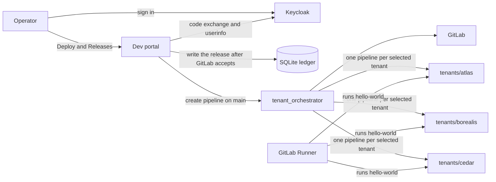
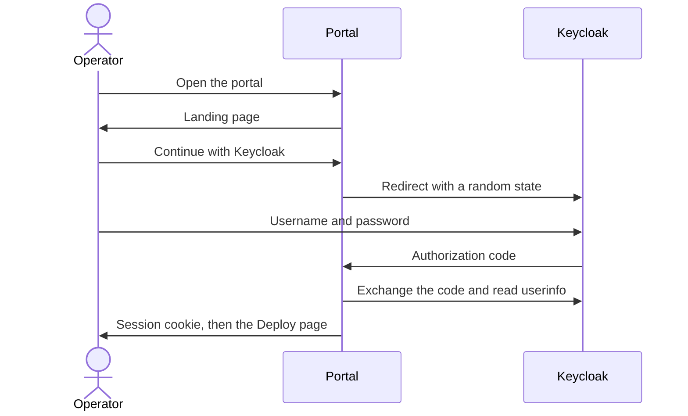
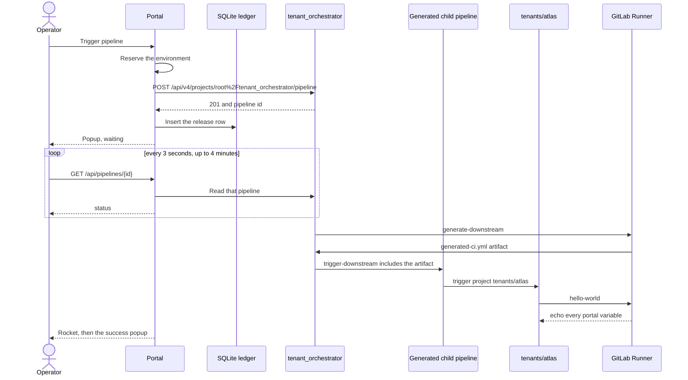
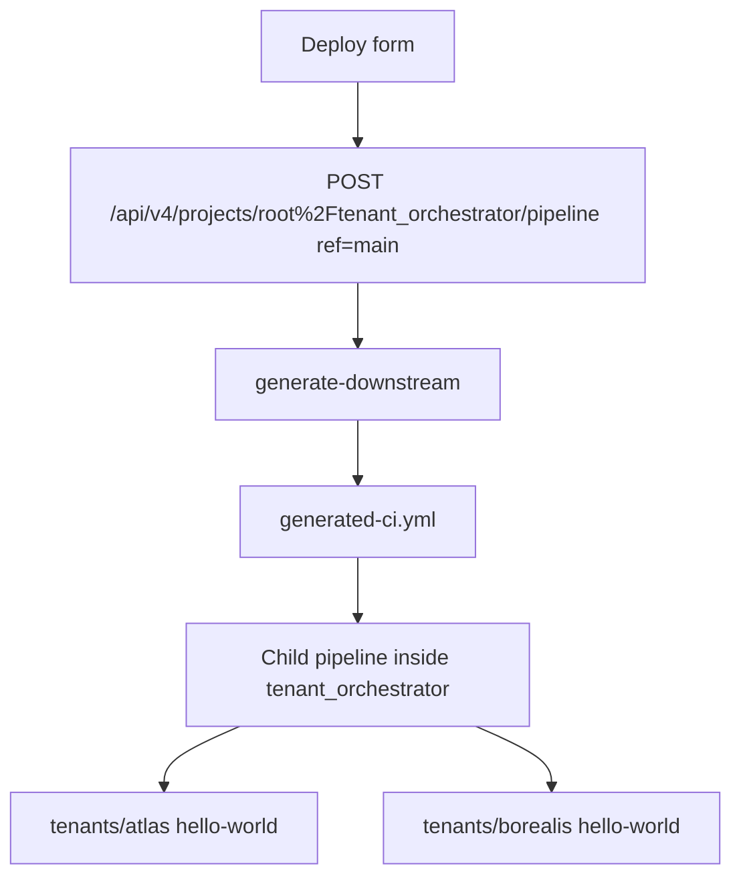

# Dev portal, end to end

An operator signs in, the portal records who asked for the release, and GitLab runs one orchestrator pipeline that starts a job in each selected tenant project.

The portal is the record of **who triggered a release and which change request they used**. GitLab is the record of **what the pipeline did**.

How the pieces fit together is below. For a walkthrough of a single click, read [tutorial.md](tutorial.md). For the EKS install, read [eks.md](eks.md).

## Pieces

| Piece | Where it runs locally | What it owns |
|---|---|---|
| Browser | http://localhost:8000 | The Deploy form, the launch popup, and the Releases chart |
| Keycloak | Docker, http://localhost:8080 | Who the operator is, and whether they are in `dev-portal-users` |
| Dev portal | Docker, port 8000 | The trigger request, the change-request rule, the in-flight lock, and the release ledger |
| SQLite ledger | `data/releases.db` | One row per pipeline this portal has started |
| GitLab CE | Docker, http://localhost:8929 | Projects, pipelines, and job logs |
| GitLab Runner | Docker, Docker executor | Running the jobs |
| Terraform | `terraform/` | The GitLab group, projects, pipeline files, and job-token allowlist |

On EKS the same portal runs as one pod. Keycloak and GitLab stay where they already are. Browser traffic comes in through the Istio gateway that is already on the cluster. See [eks.md](eks.md).



## Local wiring

Two compose files start the stack.

`docker-compose.yaml` starts Keycloak and the portal.

`docker-compose.gitlab.yaml` starts GitLab CE on port **8929** and a GitLab Runner. Port 8080 stays with Keycloak, and port 8000 stays with the portal.

```powershell
docker compose -f docker-compose.yaml -f docker-compose.gitlab.yaml up -d --build portal
```

`docker compose down` leaves GitLab running. Do not pass `--remove-orphans`. That flag removes the GitLab containers, because they come from the second compose file.

The portal container cannot call `localhost:8929`, because inside that container localhost is the portal itself. `docker-compose.yaml` sets:

- `GITLAB_BASE_URL=http://host.docker.internal:8929`
- `GITLAB_PROJECT_ID=root/tenant_orchestrator`
- `GITLAB_ORCHESTRATOR_PIPELINES_URL=http://localhost:8929/root/tenant_orchestrator/-/pipelines`
- `PORTAL_PUBLIC_URL=http://localhost:8000`

`config.py` uses the same defaults. The API path encodes the project path, so the call is `/api/v4/projects/root%2Ftenant_orchestrator/pipeline`. A numeric project id also works if you set `GITLAB_PROJECT_ID`, but the path survives a GitLab volume recreate. Numeric ids do not.

A gitignored `docker-compose.override.yaml` mounts `mock-secrets/gitlab-token.local` over `/mnt/secrets/gitlab-token`. That file is not committed. The portal reads it on startup and sends it as `PRIVATE-TOKEN`. The committed `mock-secrets/gitlab-token` is a fake token for builds that have no override.

The runner clones repositories with `http://gitlab:8929` and attaches job containers to the `dev-portal_default` Docker network. That lets a job reach the GitLab container by the name `gitlab`. Those two settings live in the runner config volume, `/etc/gitlab-runner/config.toml`.

On this machine the projects are `root/tenant_orchestrator`, `tenants/atlas`, `tenants/borealis`, and `tenants/cedar`. A new GitLab volume assigns new numeric ids. The portal keeps working because it addresses the orchestrator by path.

## Sign-in



Keycloak realm `dev-portal` is imported from `keycloak/realm-export.json`. The portal keeps a session only when the `groups` claim contains `dev-portal-users` (`KEYCLOAK_REQUIRED_GROUP`). Local account `devportal-user` / `devportal-pass` is in that group. `outsider-user` / `outsider-pass` can authenticate and is still refused.

The cookie stores the display name and email. Access tokens are discarded after userinfo returns. The session lasts eight hours. Membership is checked again the next time the operator signs in.

The browser uses `http://localhost:8080`. The portal container calls Keycloak at `http://keycloak:8080`. Both see the same issuer because Keycloak is configured with hostname `localhost`.

Logout clears the cookie and sends the browser to Keycloak, then back to `PORTAL_PUBLIC_URL/login?reason=logout`. The landing page says "You have been logged out."

These paths are open without a session: `/login`, `/login/keycloak`, `/auth/callback`, `/logout`. Everything else redirects to the landing page, and `/api/*` returns 401.

## What a release does

The Deploy page posts to `POST /api/trigger-deployment`. The portal checks the body before it talks to GitLab.

- Environment is `dev`, `test`, `preprod`, or `prod`.
- Production requires the confirmation checkbox and a change-request number such as `CHG0012345`. Any other environment drops the change-request value before it is stored.
- Tenant names are letters, numbers, `_`, or `-`, at most 20 of them.
- With "Replace existing resources" on, the extra field has to match the pipeline: a Terraform address, a Kasm state, or one of the eight services on the form.
- Extra JSON fields are rejected.

One environment can have one release that has not finished. A second click for that environment returns 409 and the popup explains which pipeline is still in flight. The other environments are independent.



The ledger row is written only after GitLab accepts the pipeline. If that write fails, the portal returns an error and tells the operator not to click again, because GitLab already has the pipeline. The environment stays locked until that pipeline reaches a finished status.

`GET /api/pipelines/{id}` answers only when that id is in the ledger. Any other id is "not found", and the portal does not call GitLab for it.

The browser treats `success` as the launch. `failed`, `canceled`, and `skipped` show a failure message and leave the rocket on the ground. If four minutes pass with the pipeline still running, the popup says to check GitLab. The orchestrator uses `strategy: depend`, so the parent status matches the child pipelines.

After a real success the popup says the pipeline ran, links to Releases, and links to `GITLAB_ORCHESTRATOR_PIPELINES_URL`. That URL is the address the operator's browser can open. Locally it is `http://localhost:8929/root/tenant_orchestrator/-/pipelines`. On EKS set `portal.gitlab.pipelinesUrl` to the company GitLab page.

The Releases page reads the ledger. It does not ask GitLab for history. The chart shows every environment. The table and CSV under it show production rows only: operator, UTC time, and change-request number.

## How one portal click becomes tenant jobs

The portal always calls the same project, `tenant_orchestrator`. It does not call atlas, borealis, or cedar itself. The tenant names travel in the variable `TENANT_LIST`.



`generate-downstream` runs `scripts/generate-downstream.sh`. The script splits `TENANT_LIST` on commas, refuses a name that is not a plain identifier, and writes one trigger job per tenant. A request for `atlas, borealis` produces triggers for `tenants/atlas` and `tenants/borealis`. Cedar is left out because it was not in the list. The script also refuses a variable that contains quotes or control characters, so a value cannot break out of the generated YAML.

`trigger-downstream` runs that file as a child pipeline and waits for it. Each trigger job starts the matching tenant project on `main`. The tenant pipeline's `hello-world` job prints the variables so you can see they arrived from the portal.

Pushing a commit to `tenant_orchestrator` does not run this flow. The orchestrator workflow ignores push pipelines. A portal trigger uses the API, so it runs.

Each tenant project allows a CI job token from `tenant_orchestrator`. That allowlist is what lets the generated trigger start the other project. Terraform defines it as `gitlab_project_job_token_scope`.

## Variables the portal sends

`gitlab_client.py` sends every key on every trigger. Unused keys are empty strings, so the tenant log still shows the full payload.

| Variable | Source in the portal |
|---|---|
| `TARGET_ENV` | Dev, test, pre-prod, or prod |
| `TENANT_LIST` | Comma-separated tenants, spaces removed |
| `PIPELINE_TRIGGER` | `tenant_baseline`, `kasm_vdi`, or `tenant_services` |
| `TAINT` | Replace-existing-resources checkbox |
| `TRIGGERED_BY` | Keycloak username |
| `CR_NUMBER` | Required for prod, empty otherwise |
| `REPLACE_RESOURCE` | Baseline replace target, only when taint is on |
| `TF_REFRESH` | Baseline refresh checkbox, only when taint is on |
| `REPLACE_STATE` | Kasm replace state, only when taint is on |
| `SERVICES_LIST` | Selected services, only when taint is on |

`TRIGGERED_BY` is the check that the pipeline came from the portal. A portal release shows the Keycloak username there, for example `devportal-user`.

The generator copies those values into the child pipeline as job variables, and the trigger also forwards pipeline variables. The tenant `hello-world` job echoes each one.

## Where the pipeline files live

| File | Copied into GitLab as |
|---|---|
| `terraform/pipeline/orchestrator-ci.yml` | `tenant_orchestrator` `.gitlab-ci.yml` |
| `terraform/pipeline/generate-downstream.sh` | `tenant_orchestrator` `scripts/generate-downstream.sh` |
| `terraform/pipeline/gitlab-ci.yml` | `.gitlab-ci.yml` in atlas, borealis, and cedar |

`terraform/main.tf` creates the `tenants` group, `tenant_orchestrator`, one project per name in `terraform/variables.tf`, the pipeline files, and the job-token allowlist. The default tenant list is atlas, borealis, and cedar.

Terraform talks to `http://localhost:8929/api/v4` with `TF_VAR_gitlab_token`. Apply it from `terraform/` after GitLab is healthy. The local state stays on this machine and is gitignored.

## Ledger

The portal stores releases in SQLite at `data/releases.db` (`/data/releases.db` inside the container). A row records the environment, tenants, pipeline trigger, operator, GitLab pipeline id, UTC time, pipeline status, and, for production, the change-request number. Production rows must have a change-request number. Other environments store that column as empty.

`pipeline_status` is the one column that changes after insert. The portal updates it while it polls GitLab. Statuses `success`, `failed`, `canceled`, `skipped`, and `unknown` mean the environment can take another release. `unknown` is what the portal stores when GitLab no longer has that pipeline, so an old sample id cannot block the environment forever.

A second table, `environment_lock`, holds the environment from the moment a trigger is sent until the pipeline id is known, and then until the pipeline finishes. Each hold has its own token. A request can release only the hold it created.

Sample history is loaded from `fixtures/sample-releases.json` with `python fixtures/import_sample_releases.py`. Those rows use pipeline ids `900001` through `900018`. Importing again replaces only those ids.

## What to open when checking a release

1. Portal Deploy page: the popup names the GitLab pipeline id, then the rocket plays only after GitLab reports success.
2. The popup link: `GITLAB_ORCHESTRATOR_PIPELINES_URL`, the orchestrator pipelines page.
3. Portal Releases page: the new point is on the chart. Production rows also appear in the ledger.
4. GitLab `tenant_orchestrator` pipeline: `generate-downstream` then `trigger-downstream`.
5. The child pipeline on `tenant_orchestrator`: one trigger box per tenant in `TENANT_LIST`.
6. `tenants/<name>` pipeline: `hello-world` log. The echoed lines are the portal payload.
